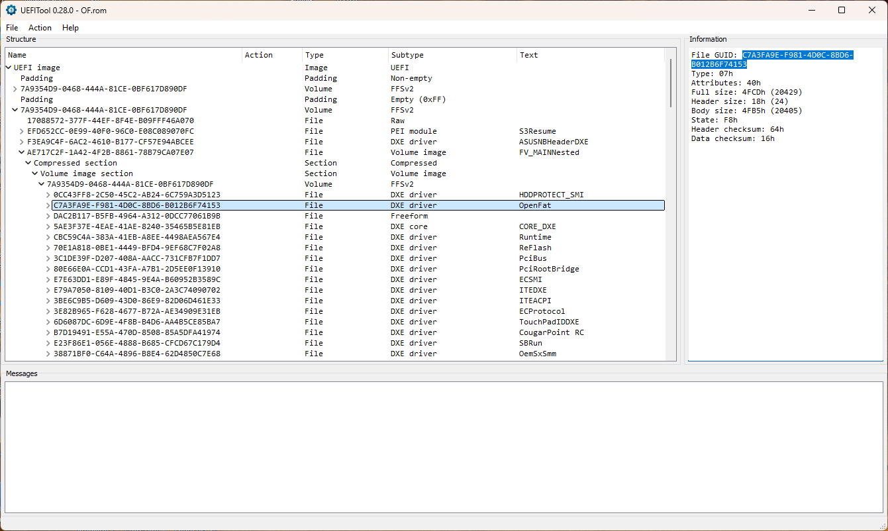

# Fat driver for early APTIO IV platforms that lack Unicode Collation 2 protocol

## Summary

The stock `Fat` driver (`Filesystem`) on APTIO IV platforms is slow and can be replaced with the `Fat` driver from `FatPkg`. This works on most APTIO IV platforms, but not on early ones that lack the Unicode Collation 2 protocol: Unicode Collation 1 was removed in `edk2-stable202511`, so the `FatPkg` driver no longer works there. `OpenFat` reintroduces support for the first protocol version and resolves this.

## Usage

### Insert into the firmware using UEFITool

#### What you'll need

 - [UEFITool 0.28.0](https://github.com/LongSoft/UEFITool/releases/tag/0.28.0) (newer NE versions can currently only read images, but not edit them)
 - The `OpenFat` driver from the OpenCore release
 - Your firmware downloaded from the vendor's website or a dump of it from the SPI Flash

#### Instructions

 1. Open UEFITool 0.28.0 and load your firmware via the `File->Open image file` menu.
 2. Open `File->Search`, click the `GUID` button, enter `93022F8C-1F09-47EF-BBB2-5814FF609DF5` (the GUID of the stock `Filesystem` driver) and click `OK`.
 3. The search results will appear in the `Messages` pane (`GUID pattern ... found as ... in ... at header-offset ...`). Double-click the line to select the `Filesystem` driver.
 4. Right-click it and choose `Replace as is`.
 5. In the file dialog, select the `OpenFat` driver.
 6. Save the image via `File->Save image file`.

To verify the result, open your modified image and repeat the 2nd step, this time using the GUID `C7A3FA9E-F981-4D0C-8BD6-B012B6F74153` (the GUID of the `OpenFat` driver), and make sure that `Filesystem` no longer appears and only `OpenFat` is listed. The correct result is shown in the screenshot.

### Flashing the SPI chip

> [!WARNING]
> Flashing modified firmware can brick your motherboard.
>
> Always keep a dump of your current firmware and have an external programmer ready, so you can restore the board if something goes wrong.
>
> **You** are solely responsible for any damage to your hardware!

Each APTIO IV platform has different protections against custom firmware, for example: Gigabyte on APTIO IV usually has few restrictions, whereas Asus, in most cases, signs its firmware and prevents the installation of custom firmware using standard methods.

There are many ways to flash firmware with the `OpenFat` driver onto your board:

 - Using `Q-Flash`, `EZ-Flash`, and other built-in utilities (but only if your vendor does not prohibit the installation of custom firmware).
 - Using an older version of `AFUDOS` that supports the `/GAN` parameter, which allows you to bypass vendor protections.
 - Using technologies like `BIOS Flashback` (the name varies by vendor, and the feature isn't always available).
 - Using a programmer like the `CH341A Pro`. This is particularly relevant for older Asus motherboards because they had a removable SPI chip.
